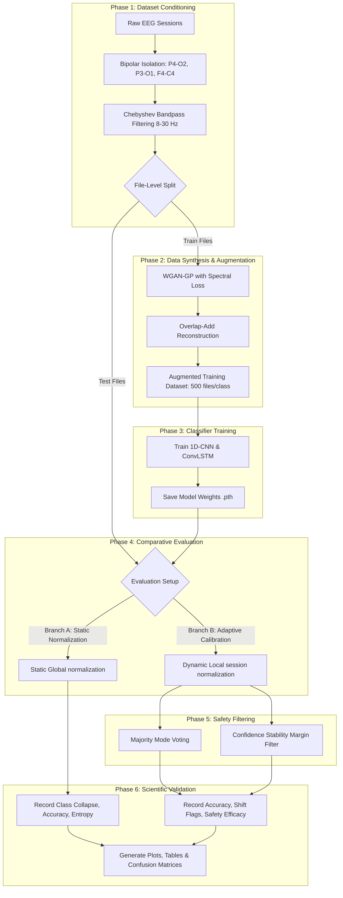

# Research Workflow: Adaptive Cross-Session BCI Calibration

This document details the step-by-step research workflow to validate and write your paper based on your finalized problem statement.

---

## 1. Visual Research Workflow

---

## 2. Step-by-Step Research Execution Plan

### Phase 1: Preprocessing & Bipolar Spatial Filter
*   **Goal:** Clean raw EEG signals and isolate localized motor-imagery/visual-attention activity.
*   **Action:** Apply the script [chebyshev_filtering.py](file:///d:/EEG/src/chebyshev_filtering.py) to isolate channels `P4-O2`, `P3-O1`, `F4-C4` and run the zero-phase 6th-order bandpass filter ($8 - 30\text{ Hz}$) to target Alpha and Beta rhythms.
*   **Paper Notation:** Define the bipolar spatial subtraction math and detail the frequency roll-off characteristics of the Chebyshev Type-I filter.

### Phase 2: Generative Augmentation with Spectral Constraints
*   **Goal:** Mitigate user fatigue/data scarcity by generating continuous synthetic records that preserve spectral profiles.
*   **Action:** Execute the WGAN-GP model in [Synthetic Data Creation.py](file:///d:/EEG/src/Synthetic%20Data%20Creation.py). The generator forces real-to-fake Power Spectral Density (PSD) matching via 1D-FFT L1 spectral loss. Windows are recombined into continuous records using Overlap-Add (OLA) averaging.
*   **Paper Notation:** Provide the loss function equation:
    $$\mathcal{L}_{G} = -\mathbb{E}[\mathcal{C}(x_{\text{fake}})] + 0.1 \times \mathcal{L}_{\text{spectral}}$$
    and detail the window stitching process.

### Phase 3: Classifier Training with Leak-Proof Validation
*   **Goal:** Train spatial-temporal decoders without introducing data leakage.
*   **Action:** Segment the data into sequences of length 256. Use file-level splitting (in [filesequenicng.py](file:///d:/EEG/src/filesequenicng.py)) to ensure training and testing splits contain completely separate recording files. Train the 1D-CNN ([1d-cnn-model.py](file:///d:/EEG/src/1d-cnn-model.py)) and ConvLSTM ([convlstm.py](file:///d:/EEG/src/convlstm.py)) architectures.
*   **Paper Notation:** Describe the layer architectures, training hyperparameters, and explain why file-level splitting is required to prevent sequence leakage.

### Phase 4: Comparative Benchmarking (The Core Experiment)
*   **Goal:** Quantify and prove the cross-session collapse, and verify the calibration recovery.
*   **Action:** Evaluate the trained models on the unseen test session files under two distinct branches:
    *   **Branch A (Baseline Control):** Detrend data, but normalize it using the static global training parameters (`GLOBAL_TRAIN_MEAN`/`GLOBAL_TRAIN_STD`).
    *   **Branch B (Proposed Calibration):** Detrend data, but dynamically scale it using active session statistics ($\mu_{\text{session}}$, $\sigma_{\text{session}}$) as coded in [1D_CNN_test.py](file:///d:/EEG/tests/1D_CNN_test.py).
*   **Paper Notation:** Tabulate accuracy and plot confusion matrices comparing Branch A vs. Branch B across all test files.

### Phase 5: Post-Processing Decision Fusion & Safety Filter Evaluation
*   **Goal:** Stabilize BCI output trajectory and filter out transition state noise.
*   **Action:** Implement Majority Mode Voting and calculate the prediction confidence margin:
    $$\Delta P = P_{\text{highest}} - P_{\text{second\_highest}}$$
    *   If $\Delta P < 0.15$ ($15\%$), flag the output as a `⚠️ SHIFTING` state.
    *   Compare the trajectory stability and trigger reliability against single-window classifiers.
*   **Paper Notation:** Plot a time-series graph of predicted directions, highlighting blocks flagged as "shifting" and showcasing how majority voting prevents accidental actions.
